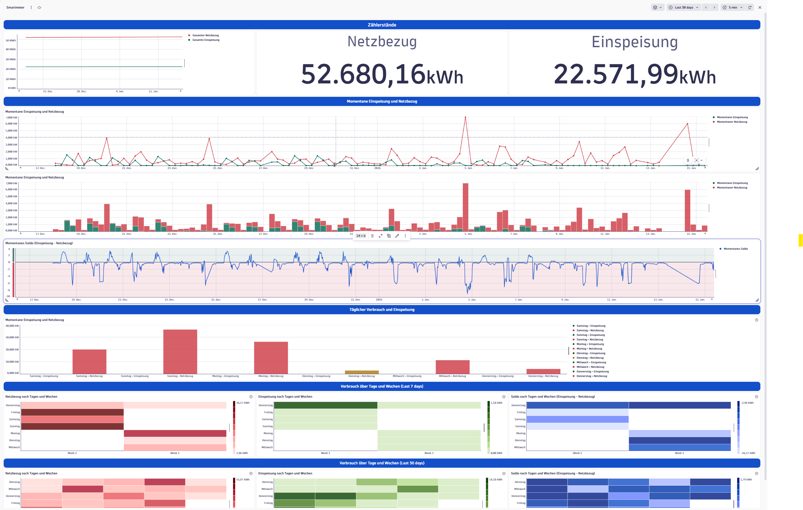
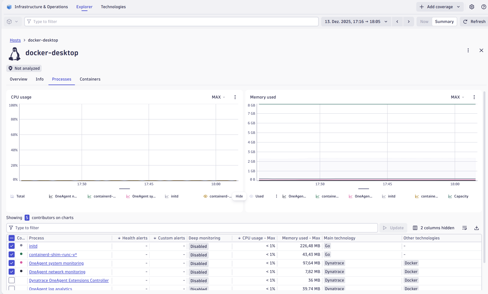

# Smartmeter Visualiserung und Notifiziereung mit Dynatrace

## Problemstatement
Da wir zuhause seit einigen Jahren eine PV anlage haben und auch seit über einem Jahr ein Elektorauto mit einer einfachen Wallbox, welche nicht intelligent ist, ist es derzeit nur schwierig herauszufinden ob das Laden es Elektroautos gerade am effizientesten ist oder nicht. Weiteres haben wir keine Information darüber ob es gerade sinvoll ist z.B. eine Waschmaschine oder einen Elektroherd einzuschalten. Dies wäre zwar theoretisch möglich, dabei müsste man aber andauernd in der App des Wechselrichters schauen. In unserem fall ein Wechselrichter der Firma `ZCS Azzurro`.

## Lösungsansatz
Die Daten der PV-Anlage werden mittels RS485-Konverter ausgelesen und an den Rasperry Pi übertragen. 
Parallel dazu werden die Daten des `Netz-Smart-Meters (Netz OÖ)` mit einem `AMIS-Lesekopf (Infrarotsensor)` erfasst und ebenfalls über `MQTT` an den Raspberry Pi übertragen. Der Raspberry Pi verarbeitet die eingehenden Daten, formatiert sie und übermittelt sie als Custom Metrics in eine Dynatrace-Umgebung. Dort werden sie über `Dashboards` visualisiert und mithilfe der `Dynatrace Query Language (DQL)` analysiert. Anschließend wird ein Altering mit der `Dynatrace Anomaly Detection` umgesetz. Weiteres wird das umgesetze Projekt welches auf einem Rasperry Pi in einem Docker Container läuft vom `Dynatrace Oneagent` gemonitort.

## ⚠️ Limitierungen welche während der Umsetzung aufgetreten sind
> **Oneagent:** Der Dynatrace OneAgent-Container **funktioniert NICHT auf Raspberry Pi 3**-Geräten.

> **Auslesen der Daten direkt vom Wechselrichter** Beim auslesen der Daten des Wechselrichters mittels Modbus Protokoll und eines RS485 Converters waren wir nicht Erfolgreich. Dokumenmtation des Wechselrichters ist sehr limitiert und ebenfalls die Hilfe eines Elektrikers der sich mit dem Azzurro Wechselrichter auskennt war nicht hilfreich.

## Ergebnisse
### Darstellung von Einspeisung/Netzbezug über einen gewissen Zeitraum


### Monitoring der Dockercontainer mittels Dynatrace One Agent
**Note:** Mittels Rasperry PI 3 nicht möglich, da die Architektur dieses Pi´s nicht vom Oneagent unterstützt wird. Monitoring wurde also nur Beispielhaft mit Docker Desktop umgesetzt um die mögliche verwendung darzustellen.

#### Overview

#### Importierte Metriken
| OBIS-Code | Metrikname | Beschreibung |
|-----------|------------|--------------|
| 1.8.0 | `smartmeter.energy.active.import.total` | Gesamte importierte Wirkenergie (kWh) |
| 2.8.0 | `smartmeter.energy.active.export.total` | Gesamte exportierte Wirkenergie (kWh) |
| 3.8.1 | `smartmeter.energy.reactive.import.total` | Gesamte importierte Blindenergie (kvarh) |
| 4.8.1 | `smartmeter.energy.reactive.export.total` | Gesamte exportierte Blindenergie (kvarh) |
| 1.7.0 | `smartmeter.power.active.import` | Aktuelle Wirkleistungsaufnahme (kW) |
| 2.7.0 | `smartmeter.power.active.export` | Aktuelle Wirkleistungsabgabe (kW) |
| 3.7.0 | `smartmeter.power.reactive.import` | Aktuelle Blindleistungsaufnahme (kvar) |
| 4.7.0 | `smartmeter.power.reactive.export` | Aktuelle Blindleistungsabgabe (kvar) |
| saldo | `smartmeter.power.active.saldo` | Netto-Wirkleistung (kW) |
| 1.128.0 | `smartmeter.inkasso` | Abrechnungs-/Inkassostatus |


#### Processes

#### Hosts

#### Alamierung falls Host nicht mehr erreichbar ist oder Probleme hat


**TODO** Notifizierung!

## Projektstruktur
```
MUS1-Project/
├── docker-compose.yml          # Container-Orchestrierung
├── Dockerfile                  # Python-Anwendungscontainer
├── README.md                   # Dokumentaion
├── .env                        # Umgebungsvariablen
├── mosquitto/
│   ├── config/
│   │   ├── mosquitto.conf      # MQTT-Broker-Konfiguration
│   │   └── passwd              # MQTT-Benutzeranmeldedaten
│   ├── data/                   # Persistente MQTT-Daten
│   └── log/                    # MQTT-Broker-Protokolle
└── docs/ # Sources for documentation
└── src/
    └── dynatrace-metrics-ingest.py  # Hauptanwendung
```

## Implementierung

### Verwendete Technologien

| Technologie | Zweck |
|-------------|-------|
| **Python** | Implementierung des Python Clients |
| **MQTT** | Kommunikation zwischen Sensor und Python Client |
| **Docker** | Containerisierung |
| **Docker Compose** | Multi-Container-Orchestrierung |
| **Rasperry PI 3** | Ausführung der Docker Container |
| **AMIS Smartreader** | Auslesen der Smartmeterdaten |
| **Dynatrace Platform** | Auswertungen, Notifizierung, Monitoring |

## Architektur

```
┌─────────────────────┐      MQTT       ┌───────────────────┐      HTTP/REST      ┌─────────────┐
│   Smart Meter Reader│ ──────────────► │  Mosquitto Broker │  ◄───────────────── │  Dynatrace  │
│   (Publisher)       │                 │    (Port 1883)    │                     │   Tenant    │
└─────────────────────┘                 └─────────┬─────────┘                     └──────▲──────┘
                                                  │                                      │
                                                  │ Abonnieren                           │
                                                  ▼                                      │
                                        ┌─────────────────────┐                          │
                                        │  Metric Ingest App  │ ─────────────────────────┘
                                        │  (Python Container) │   Metrics Ingest API v2
                                        └─────────────────────┘
```
## Einrichtung des Smartmeter Sensors
Information und Dokumentation über das aufsetzen des Smartmeter Sensors und das senden der Daten über einen MQTT broker können [hier](https://github.com/mgerhard74/amis_smartmeter_reader) gefunden werden.

## Client Implememtierung
```python
import paho.mqtt.client as mqtt
import requests
import json
import time
import os      
from dotenv import load_dotenv

load_dotenv()

# Dynatrace Configuration from environment variables
TENANT_HOST = os.getenv("TENANT_HOST")
API_TOKEN = os.getenv("API_TOKEN")
DT_METRICS_INGEST_ENDPOINT = f"https://{TENANT_HOST}/api/v2/metrics/ingest"

# MQTT Configuration from environment variables
MQTT_BROKER = os.getenv("MQTT_BROKER")
MQTT_PORT = int(os.getenv("MQTT_PORT"))
MQTT_USER = os.getenv("MQTT_USER")
MQTT_PASSWORD = os.getenv("MQTT_PASSWORD")
MQTT_CLIENT_ID = os.getenv("MQTT_CLIENT_ID")
MQTT_TOPIC = os.getenv("MQTT_TOPIC")

METRIC_MAP = {
    "1.8.0": "smartmeter.energy.active.import.total",  
    "2.8.0": "smartmeter.energy.active.export.total", 
    "3.8.1": "smartmeter.energy.reactive.import.total",
    "4.8.1": "smartmeter.energy.reactive.export.total",
    "1.7.0": "smartmeter.power.active.import",        
    "2.7.0": "smartmeter.power.active.export",        
    "3.7.0": "smartmeter.power.reactive.import",
    "4.7.0": "smartmeter.power.reactive.export",
    "saldo": "smartmeter.power.active.saldo",    
    "1.128.0": "smartmeter.inkasso"
}

def send_to_dynatrace(payload):
    if not payload:
        return

    payload_str = "\n".join(payload)
    headers = {
        "Authorization": f"Api-Token {API_TOKEN}",
        "Content-Type": "text/plain; charset=utf-8"
    }

    try:
        r = requests.post(DT_METRICS_INGEST_ENDPOINT, headers=headers, data=payload_str, timeout=5)
        
        if r.status_code == 202:
            print(f"Dynatrace Ingest Success ({len(payload)} metrics)")
        else:
            print(f"Dynatrace Error {r.status_code}: {r.text}")
            
    except requests.RequestException as e:
        print(f"Network Error sending to Dynatrace: {e}")
        
        

# MQTT callback for connection
def on_connect(client, userdata, flags, reason_code, properties):
    if reason_code == 0:
        print("Connected to MQTT Broker!")
        client.subscribe(MQTT_TOPIC)
        print(f"Subscribed to topic: {MQTT_TOPIC}")
    else:
        print(f"Failed to connect, return code {reason_code}")

# MQTT callback for message reception and sending to Dynatrace
def on_message(client, userdata, msg):
    try:
        # 1. Parse JSON
        payload_str = msg.payload.decode('utf-8')
        data = json.loads(payload_str)
        
        dt_payload_lines = []

        # 2. Iterate over the JSON keys and map them
        for key, value in data.items():
            if key in METRIC_MAP:
                metric_key = METRIC_MAP[key]
                
                # Math Logic: Divide by 1000 for everything except status codes
                if key == "1.128.0":
                    final_value = value
                else:
                    final_value = float(value) / 1000.0
                
                line = f"{metric_key} {final_value}"
                dt_payload_lines.append(line)

        # 3. Send to Dynatrace
        if dt_payload_lines:
            print(f"\nReceived MQTT Data. Sending {len(dt_payload_lines)} metrics...")
            send_to_dynatrace(dt_payload_lines)
        
    except json.JSONDecodeError:
        print(f"Received non-JSON message")
    except Exception as e:
        print(f"Error in processing: {e}")
       
# MQTT Client Setup
client = mqtt.Client(
    callback_api_version=mqtt.CallbackAPIVersion.VERSION2, 
    client_id=MQTT_CLIENT_ID
)

# set authentication and callbacks
client.username_pw_set(MQTT_USER, MQTT_PASSWORD)
client.on_connect = on_connect
client.on_message = on_message

# Connect to MQTT Broker and start loop
try:
    client.connect(MQTT_BROKER, MQTT_PORT, 60)
    client.loop_start()
    print(f"Sending data to {DT_METRICS_INGEST_ENDPOINT}")
    
    
    while True:
        time.sleep(1)

except Exception as e:
    print(f"Error: {e}")
finally:
    client.loop_stop()
```

## Dynatrace-Integration

### Metrics Ingest API

Die Anwendung verwendet die **Dynatrace Metrics Ingest API v2** (`/api/v2/metrics/ingest`), um Smart-Meter-Metriken direkt in Ihre Dynatrace-Umgebung zu übertragen.

**Erforderliche API-Token-Berechtigungen:**
- `metrics.ingest` - Metriken einspeisen

### Konfiguration

Die folgenden Umgebungsvariablen müssen für Dynatrace konfiguriert werden:

| Variable | Beschreibung | Beispiel |
|----------|--------------|----------|
| `TENANT_HOST` | Ihre Dynatrace-Tenant-URL (ohne https://) | `abc12345.live.dynatrace.com` |
| `API_TOKEN` | API-Token mit `metrics.ingest`-Berechtigung | `dt0c01.XXX...` |

---

## MQTT-Konfiguration

Die Anwendung verbindet sich mit einem Eclipse Mosquitto MQTT-Broker zum Empfang von Smart-Meter-Daten.

### Umgebungsvariablen

| Variable | Beschreibung | Standard |
|----------|--------------|----------|
| `MQTT_BROKER` | MQTT-Broker-Hostname | `mosquitto` (Container-Name) |
| `MQTT_PORT` | MQTT-Broker-Port | `1883` |
| `MQTT_USER` | MQTT-Benutzername | - |
| `MQTT_PASSWORD` | MQTT-Passwort | - |
| `MQTT_CLIENT_ID` | Eindeutige Client-Kennung | - |
| `MQTT_TOPIC` | Zu abonnierendes Topic | - |

---

## Dynatrace OneAgent

Die `docker-compose.yml` enthält einen Dynatrace OneAgent-Container für Full-Stack-Monitoring.

### Konfiguration

| Variable | Beschreibung |
|----------|--------------|
| `DT_ONEAGENT_URL` | OneAgent-Installer-Skript-URL aus Ihrer Dynatrace-Umgebung |

### OneAgent-Container-Einstellungen

Der OneAgent läuft mit:
- **Privilegierter Modus**: Erforderlich für vollen Systemzugriff
- **Host-Netzwerkmodus**: Für die Überwachung von Host-Level-Metriken
- **Host-PID-Namespace**: Für Prozesssichtbarkeit
- **Root-Dateisystem-Mount**: Für vollständige Host-Überwachung

---

## ⚠️ Raspberry Pi 3 Einschränkung

> **Wichtig:** Der Dynatrace OneAgent-Container **funktioniert NICHT auf Raspberry Pi 3**-Geräten.

### Grund

Der Raspberry Pi 3 verwendet eine **ARMv7 (32-Bit)**-Architektur, die von Dynatrace OneAgent **nicht unterstützt** wird. OneAgent erfordert:
- **x86_64 (AMD64)**-Architektur, oder
- **ARM64 (AArch64)**-Architektur (Raspberry Pi 4 und neuer)

### Workaround für Raspberry Pi 3

Bei der Bereitstellung auf Raspberry Pi 3:

1. **Entfernen oder kommentieren Sie den OneAgent-Dienst** in `docker-compose.yml` aus
2. **Verlassen Sie sich auf die Metrics Ingest API** zum Senden von Daten an Dynatrace (dies funktioniert unabhängig von der Architektur)

Die Kernfunktionalität (MQTT → Dynatrace-Metrikeinspeisung) funktioniert auf Raspberry Pi 3, nur das OneAgent-basierte Host-Monitoring ist nicht verfügbar.

## Bereitstellung und starten der Applikation

### Voraussetzungen

1. Docker und Docker Compose installiert
2. Eine Dynatrace-Umgebung mit API-Zugang ist vorhanden
3. Ein API-Token mit `metrics.ingest`-Berechtigung ist vorhanden
4. Smartmetersensor mit ESP32 und Rasperry Pi befinden sich im selben LAN

### Einrichtung

1. **Repository klonen**
   ```bash
   git clone <repository-url>
   cd MUS1-Project
   ```

2. **Erstellen Sie eine `.env`-Datei** im Projektstammverzeichnis:
   ```env
   # Dynatrace
   TENANT_HOST=your-tenant.live.dynatrace.com
   API_TOKEN=dt0c01.your-api-token
   DT_ONEAGENT_URL=https://your-tenant.live.dynatrace.com/api/v1/deployment/installer/agent/unix/default/latest?Api-Token=...

   # MQTT
   MQTT_PORT=1883
   MQTT_USER=your-mqtt-user
   MQTT_PASSWORD=your-mqtt-password
   MQTT_CLIENT_ID=smartmeter-ingest
   MQTT_TOPIC=smartmeter/data
   ```

3. **Starten der Container auf Windows**
   ```bash
   docker-compose up -d
   ```

4. **Für Raspberry Pi 3** verwenden Sie einen modifizierten Compose-Befehl:
   ```bash
   docker-compose up -d mosquitto smartmeter-metric-ingest
   ```

## Verwendete Technologien und nützliche Dokumentation
[Dynatrace Metrics Ingest](https://docs.dynatrace.com/docs/discover-dynatrace/references/dynatrace-api/environment-api/metric-v2/post-ingest-metrics)  
[Dynatrace Dashboards](https://docs.dynatrace.com/docs/analyze-explore-automate/dashboards-and-notebooks/dashboards-new)  
[Dynatrace Oneagent](https://docs.dynatrace.com/docs/ingest-from/dynatrace-oneagent)  
[Dynatrace DQL](https://docs.dynatrace.com/docs/discover-dynatrace/platform/grail/dynatrace-query-language)  
[Smartmeter Auslesung des NetzOÖ Smartmeters](https://github.com/mgerhard74/amis_smartmeter_reader)  
[Oneagent for Linux](https://docs.dynatrace.com/docs/ingest-from/dynatrace-oneagent/installation-and-operation/linux/installation/install-oneagent-on-linux)  

